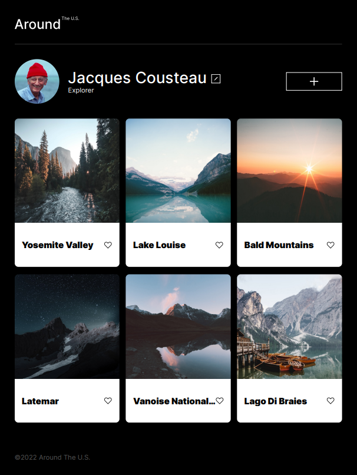
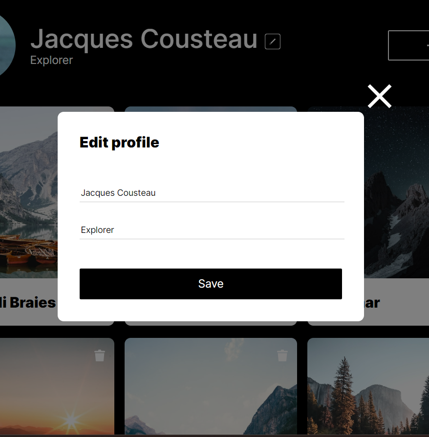
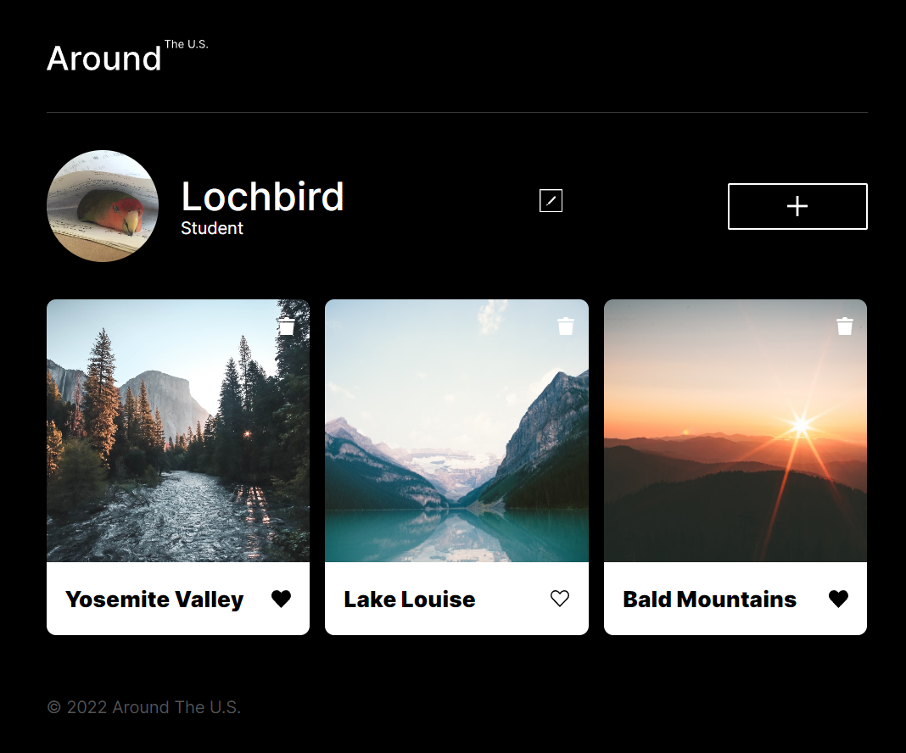

# Project 3-9: Around The U.S.

### Overview

- Intro
- Figma
- Images
- Javascript
- Webpack
- API

**Intro**

This project is the stepping stone to many programming languages and practices.
In Sprint 3, I made it so all the elements are displayed correctly on popular screen sizes so that there is a mobile version and a computer version of my website.
In Sprint 4 and 5, I implemented Javascript functionality to reveal the appropriate pop-ups when the buttons are clicked, the ability to add/delete cards, and edit your profile's name and description. You can even click on the card's image so that it'll zoom in for better clarity.
In Sprint 6, I added Form Validation for both the Edit Profile and the Add Card forms. I also added the ability to close the various pop-ups by either clicking off the pop-up or clicking the ESC key.
Sprint 7 was rather tricky. This sprint focused entirely on organization via OOP. I learned how to create classes and delegate files so that the code becomes more readable and digestible.
Sprint 8 covered Webpack installation and adding additional classes using practices like Super(). I learned the various issues with Webpack and how to overcome them, but I think I still have a long way to go with understanding it.
Sprint 9 incorporated API functionality. Using authorization tokens and various methods that returned values from the server, the website can now keep its changes even after the page refreshes. I also added a delete confirmation to make sure you do mean to delete the card, and you can now edit the profile picture.

**Figma**

- [Link to the project on Figma](https://www.figma.com/file/ii4xxsJ0ghevUOcssTlHZv/Sprint-3%3A-Around-the-US?node-id=0%3A1)

**Images**

**Improvements**
Media Queries are very interesting, but is still a concept I need to wrap my head around.
What I would love to work on more is adding additional transitions and animations to the elements when the resolution changes, so that it isn't so snappy to make it look nicer. The profile image, for example, can flow to the center instead of teleporting when the resolution goes below tablet-size.
When it comes to the cards, they're just simply images. I'd like to see how it is that Instagram or Tiktok allows you to share videos so seamlessly across their applications.
I'm curious of adding a way to add a background image, or to choose from a list of pre-chosen pictures for the background so it isn't just black. Personalization changes.

[Link to Around The U.S.](https://lochbird.github.io/se_project_aroundtheus/)
