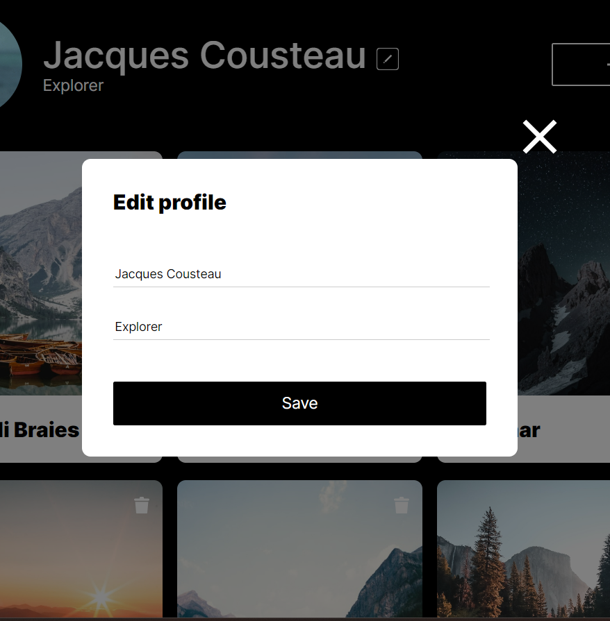

# Project 3: Around The U.S.

### Overview

- Intro
- Figma
- Images

**Intro**

This project is made so all the elements are displayed correctly on popular screen sizes. Since then the project has taken everything I have learned about Javascript: the appropriate pop-ups reveal themselves when the buttons are clicked, cards can be added and deleted, and form validation has been added. 

**Figma**

- [Link to the project on Figma](https://www.figma.com/file/ii4xxsJ0ghevUOcssTlHZv/Sprint-3%3A-Around-the-US?node-id=0%3A1)

**Images**

**Improvements**
Media Queries are very interesting, but is still a concept I need to wrap my head around. It's like thinking you learned how to throw a ball before you realize it needs to be tossed in a hoop in order for it to count. You can guess how it can make it to the hoop, but it's a new process nonetheless.
What I would love to work on more is adding additional transitions and animations to the elements when the resolution changes, so that it isn't so snappy to make it look nicer. The profile image, for example, can flow to the center instead of teleporting when the resolution goes below tablet-size.

[Link to Around The U.S.](https://lochbird.github.io/se_project_aroundtheus/)
